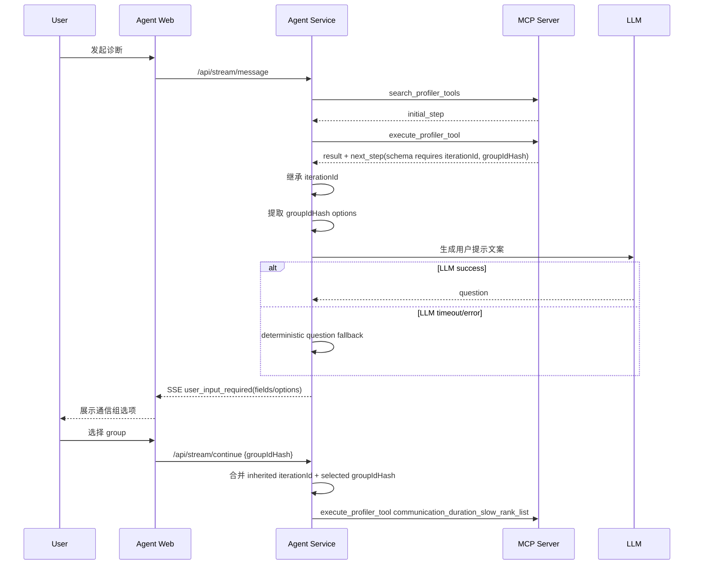
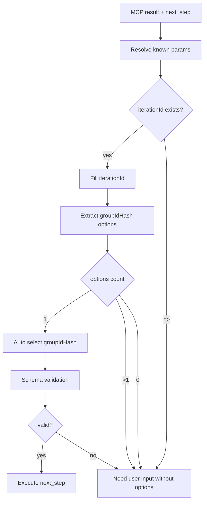

# 设计文档：MCP 约束下的智能诊断 Agent 增强

关联需求文档：`docs/mcp_guided_agent_enhancement_requirements.md`

## 1. 设计目标

本设计面向 Agent Service 与 Agent Web 的交互增强，目标是在不改变 MCP 元工具模式和 MCP Server 当前返回形态的前提下，解决以下问题：

1. LLM 辅助失败日志不可诊断；
2. 下一步工具参数解析时历史参数继承不稳定，例如 `iterationId` 被误判为缺失；
3. 上一步 MCP 结果中的候选参数未透传前端，例如 `groupIdHash` 候选项；
4. `user_input_required` 事件缺少字段级输入结构；
5. 前端只能展示通用缺参提示，无法展示字段级选择控件；
6. 在 MCP/schema/interaction policy 约束内增强 LLM 对用户提示文案的生成能力。

本设计不改变以下边界：

- 不新增 MCP 顶层工具；
- 不绕过 `search_profiler_tools` / `execute_profiler_tool`；
- 不允许 LLM 自由选择非 MCP `next_step` 工具；
- 不重构 MCP Server 当前 `data.text` 混合 markdown/JSON 的返回格式；
- 不实现传统自由 ReAct Agent。

---

## 2. 当前系统触点

### 2.1 Backend

主要文件：

- `agent-service/src/core/agents/base.py`
  - `AgentRequirement`
  - `AgentResult`
- `agent-service/src/core/agents/diagnosis_agent.py`
  - `DiagnosisAgent.run(...)`
  - `DiagnosisAgent.resume(...)`
  - `_build_suspension_requirement(...)`
  - `_execute_tool_and_check_next(...)`
- `agent-service/src/core/diagnosis/resolver.py`
  - `ParameterResolver.resolve_for_step(...)`
  - `ParameterResolutionResult`
- `agent-service/src/core/mcp_llm_assistant.py`
  - `_chat_json(...)`
  - `extract_parameters_by_schema(...)`
  - `extract_parameters(...)`
- `agent-service/src/models/orchestration.py`
  - `PendingInput`
  - `PendingInputOption`
  - `SSEEventEnvelope`
- `agent-service/src/core/orchestrator.py`
  - `user_input_required` SSE event construction

### 2.2 Frontend

主要文件：

- `agent-web/src/types/index.ts`
  - `UserInputRequiredData`
- `agent-web/src/components/ChatView.tsx`
  - `handleSSEEvent(...)`
  - `handleSubmit(...)`
  - `handleSelectOption(...)`
- `agent-web/src/stores/index.ts`
  - `setUserInputRequired(...)`
  - `setPendingInput(...)`
- `agent-web/src/services/api.ts`
  - `streamApi.continueAnalysis(...)`
  - SSE event parsing

---

## 3. 总体架构设计

### 3.1 增强后的 Agent 编排层

```text
MCP execute_profiler_tool result
  ↓
MCP response parser / gateway result
  ↓
DiagnosisContext update
  ↓
Parameter Context Binder
  ↓
Candidate Extractor
  ↓
Parameter Resolver
  ↓
Interaction Decision
  ├─ 参数完整 → execute next_step
  ├─ 单个候选 → auto select → execute next_step
  └─ 需要用户输入 → build field-level user_input_required
        ↓
  Prompt Composer
        ├─ LLM prompt composition enabled → 尝试生成用户友好提示
        └─ LLM timeout/error → deterministic fallback
        ↓
SSE user_input_required
  ↓
Frontend field-level input rendering
  ↓
/api/stream/continue
```

### 3.2 职责分层

| 层 | 职责 | 是否允许 LLM 参与 |
|---|---|---|
| MCP Server | playbook 导航、工具依赖、next_step、schema | 否 |
| MCPGateway/Parser | 解析 MCP 结果，暴露 text/raw/next_step/control_flow | 否 |
| DiagnosisContext | 保存诊断历史、工具参数、工具输出、known params | 否 |
| Parameter Context Binder | 合并历史参数、用户输入、上一步结果 | 否，必须 deterministic |
| Candidate Extractor | 从 known params / output / schema 提取候选项 | 否，优先 deterministic |
| Parameter Resolver | 解析并校验当前 step 参数 | LLM 可 advisory |
| Interaction Decision | 决定自动执行、自动选择或暂停问用户 | 否，必须 deterministic/policy based |
| Prompt Composer | 生成用户友好提示 | 是，但只生成文案 |
| Frontend | 渲染字段级输入控件 | 否 |

---

## 4. 数据模型设计

### 4.1 字段级输入模型

后端无需立即强制新增 Pydantic 模型，也可以先通过 `AgentRequirement.metadata.fields` 兼容实现。建议逻辑模型如下：

```python
class InputFieldOption(BaseModel):
    label: str
    value: Any
    description: str = ""
    metadata: Dict[str, Any] = Field(default_factory=dict)


class InputField(BaseModel):
    name: str
    label: str
    type: Literal["string", "select", "path", "confirm"] = "string"
    required: bool = True
    description: str = ""
    value: Any = None
    options: List[InputFieldOption] = Field(default_factory=list)
    metadata: Dict[str, Any] = Field(default_factory=dict)
```

短期可直接序列化为 dict：

```json
{
  "name": "groupIdHash",
  "label": "通信组",
  "type": "select",
  "required": true,
  "description": "Hash identifier of the communication group to analyze.",
  "options": [
    {
      "label": "mock_pg / mock_group_hash / 120.5ms / ranks: 0,1",
      "value": "mock_group_hash",
      "metadata": {
        "groupIdHash": "mock_group_hash",
        "pgName": "mock_pg",
        "duration": 120.5,
        "rankList": ["0", "1"]
      }
    }
  ]
}
```

### 4.2 参数来源模型

用于日志、metadata 和用户可见说明。

```json
{
  "iterationId": {
    "value": "3",
    "source": "previous_step_args",
    "display": "迭代 ID 已沿用上一步：3",
    "confidence": 1.0
  },
  "groupIdHash": {
    "value": "mock_group_hash",
    "source": "auto_selected_single_option",
    "display": "已自动选择唯一通信组：mock_pg / mock_group_hash",
    "confidence": 1.0
  }
}
```

建议来源枚举：

- `user_input`
- `user_selected_option`
- `auto_selected_single_option`
- `previous_step_args`
- `previous_step_output`
- `session_context`
- `mcp_context`
- `schema_default`
- `llm_extraction`
- `deterministic_extraction`

### 4.3 LLM 辅助状态模型

用于后端日志和前端 metadata。

```json
{
  "llm_assistance": {
    "status": "timeout",
    "stage": "extract_parameters_by_schema",
    "fallback": "deterministic_parameter_resolution"
  }
}
```

后端日志中使用更完整结构：

```json
{
  "stage": "extract_parameters_by_schema",
  "tool_name": "communication_duration_slow_rank_list",
  "required_keys": ["iterationId", "groupIdHash"],
  "timeout_seconds": 30,
  "elapsed_ms": 30012.45,
  "provider": "claude",
  "model": "claude-sonnet-4-6",
  "exception_type": "TimeoutError",
  "exception_repr": "TimeoutError()",
  "fallback": "deterministic_parameter_resolution"
}
```

---

## 5. Backend 设计

## 5.1 LLM 日志增强设计

### 5.1.1 修改点

文件：`agent-service/src/core/mcp_llm_assistant.py`

核心函数：

- `_chat_json(stage, messages)`
- 调用 `_chat_json` 的上层 API 可逐步增加 context 参数。

### 5.1.2 设计

引入可选上下文参数：

```python
async def _chat_json(
    self,
    stage: str,
    messages: List[Dict[str, str]],
    *,
    log_context: Optional[Dict[str, Any]] = None,
) -> Optional[Dict[str, Any]]:
    ...
```

记录：

- `stage`
- `elapsed_ms`
- `timeout_seconds`
- `provider`
- `model`
- `exception_type`
- `exception_repr`
- `fallback`
- `tool_name`
- `required_keys`
- `schema_keys`

Timeout 单独处理：

```python
except asyncio.TimeoutError as exc:
    logger.warning(
        "LLM assistance timeout at %s: timeout_seconds=%s elapsed_ms=%.2f provider=%s model=%s fallback=%s context=%s",
        stage,
        self.config.timeout_seconds,
        elapsed_ms,
        provider,
        model,
        fallback,
        safe_context,
    )
    self._last_failure = {...}
    return None
```

普通异常：

```python
except Exception as exc:
    logger.warning(
        "LLM assistance failed at %s: exc_type=%s exc_repr=%r elapsed_ms=%.2f provider=%s model=%s context=%s",
        stage,
        type(exc).__name__,
        exc,
        elapsed_ms,
        provider,
        model,
        safe_context,
    )
    self._last_failure = {...}
    return None
```

### 5.1.3 前端透传

`ParameterResolutionResult` 或 resolver metadata 中应能包含简化失败信息：

```json
{
  "llm_assistance": {
    "status": "timeout",
    "stage": "extract_parameters_by_schema",
    "fallback": "deterministic_parameter_resolution"
  }
}
```

可选实现路径：

1. `MCPLLMOrchestrationAssistant` 保存最近一次失败摘要；
2. `ParameterResolver` 在调用失败后读取并写入 resolution metadata；
3. `DiagnosisAgent` 在构建 `AgentRequirement.metadata` 时透传。

为了避免全局状态污染，更推荐让 LLM API 返回包装结果，但这会改动较大。短期可用 assistant 实例级 last failure，并在每次调用前清空。

---

## 5.2 参数上下文绑定设计

### 5.2.1 修改点

文件：`agent-service/src/core/diagnosis/resolver.py`

核心函数：

- `ParameterResolver.resolve_for_step(...)`

### 5.2.2 设计目标

在缺参判断前，先 deterministic 合并历史参数，确保 `iterationId` 这类已知参数不会依赖 LLM 重新抽取。

### 5.2.3 参数合并优先级

建议顺序：

```text
1. MCP suggested_args
2. existing_args
3. current_user_input
4. context known params
5. latest step output params
6. schema defaults
7. LLM advisory extraction
```

注意：如果用户本轮显式输入与历史参数冲突，应由现有 conflict 机制处理，用户输入优先级应高于历史继承。

最终所有参数必须经过 schema 过滤：

```python
allowed_keys = set(step.schema_.get("properties", {}).keys())
arguments = {k: v for k, v in arguments.items() if k in allowed_keys}
```

### 5.2.4 参数来源追踪

在合并参数时同步维护：

```python
param_sources: Dict[str, Dict[str, Any]]
```

示例：

```python
param_sources["iterationId"] = {
    "value": "3",
    "source": "previous_step_args",
    "display": "迭代 ID 已沿用上一步：3",
    "confidence": 1.0,
}
```

`ParameterResolutionResult` 建议增加：

```python
metadata: Dict[str, Any] = Field(default_factory=dict)
```

或在现有返回对象中新增：

```python
param_sources: Dict[str, Any] = Field(default_factory=dict)
llm_assistance: Dict[str, Any] = Field(default_factory=dict)
```

如果希望最小改动，可将这些放入 `filled` 或额外 metadata dict，但长期建议显式字段。

---

## 5.3 候选项提取设计

### 5.3.1 修改点

文件：`agent-service/src/core/agents/diagnosis_agent.py`

可新增私有方法：

```python
def _collect_field_options(
    self,
    field_name: str,
    *,
    context: DiagnosisContext,
    metadata: Dict[str, Any],
    schema: Dict[str, Any],
) -> List[Dict[str, Any]]:
    ...
```

或拆分为：

```python
def _extract_group_id_hash_options(...): ...
def _format_group_option(...): ...
def _collect_options_from_known_params(...): ...
def _collect_options_from_schema(...): ...
```

### 5.3.2 候选项来源优先级

```text
1. MCP control_flow.required_inputs[*].options
2. next_step schema enum/options
3. candidate_inputs.<field>
4. known_params 中的 <field>_options / <field>Options / candidates
5. known_params 中的 groups / group_candidates
6. latest step output 中包含 field_name 的对象列表
7. text/fenced JSON 中已由现有 _extract_produced_params 提取出的 data 列表
```

### 5.3.3 groupIdHash 特化规则

对于 `groupIdHash`，识别对象：

```json
{
  "groupIdHash": "mock_group_hash",
  "pgName": "mock_pg",
  "duration": 120.5,
  "rankList": ["0", "1"]
}
```

格式化：

```python
def _format_group_option(item):
    group_hash = item.get("groupIdHash")
    pg_name = item.get("pgName") or item.get("parallelStrategy") or "通信组"
    duration = item.get("duration")
    ranks = item.get("rankList") or item.get("ranks")
    label_parts = [pg_name, group_hash]
    if duration is not None:
        label_parts.append(f"{duration}ms")
    if ranks:
        label_parts.append(f"ranks: {','.join(map(str, ranks))}")
    return {
        "label": " / ".join(label_parts),
        "value": group_hash,
        "metadata": item,
    }
```

### 5.3.4 单候选自动选择

如果某个 required field 缺失，但候选项只有一个：

```text
missing_required = ["groupIdHash"]
options[groupIdHash].length == 1
```

则自动填充：

```python
arguments["groupIdHash"] = options[0]["value"]
param_sources["groupIdHash"] = {
    "source": "auto_selected_single_option",
    "display": f"已自动选择唯一通信组：{options[0]['label']}",
}
```

然后重新执行 required check。

如果自动选择后参数完整：

- 不发 `user_input_required`；
- 直接执行 MCP `next_step`；
- 可以通过普通消息或 trace event 展示“已自动选择唯一通信组”。

如果多个候选：

- 发 `user_input_required`；
- 不做 LLM 推荐；
- 保持候选项顺序或确定性排序。

---

## 5.4 `user_input_required` 构建设计

### 5.4.1 修改点

文件：`agent-service/src/core/agents/diagnosis_agent.py`

核心函数：

- `_build_suspension_requirement(...)`
- `_execute_tool_and_check_next(...)` 中 `NEEDS_USER_INPUT` 分支

### 5.4.2 输出结构

新的 `AgentRequirement`：

```python
AgentRequirement(
    input_type="params",
    question="已完成通信组耗时分析。下一步将定位引发通信阻塞的 Slow Rank。请选择要继续分析的通信组。",
    options=[...],  # 兼容旧前端，单字段 select 时同步写入
    metadata={
        "agent_type": "diagnosis",
        "resume_action": "continue_mcp_with_args",
        "tool_name": "communication_duration_slow_rank_list",
        "missing_required": ["groupIdHash"],
        "resolved_arguments": {"iterationId": "3"},
        "param_sources": {...},
        "fields": [
            {
                "name": "groupIdHash",
                "label": "通信组",
                "type": "select",
                "required": True,
                "description": "Hash identifier of the communication group to analyze.",
                "options": [...],
            }
        ],
        "llm_assistance": {
            "status": "timeout",
            "stage": "extract_parameters_by_schema",
            "fallback": "deterministic_parameter_resolution",
        },
    },
)
```

### 5.4.3 多字段策略

- 如果多个字段缺失：每个字段都创建一个 `field`；
- 有 options 的字段为 `select`；
- 无 options 的字段为 `string`；
- 顶层 `options` 仅在一个字段为 select 时填充，用于旧前端兼容；
- 新前端必须优先使用 `metadata.fields`。

### 5.4.4 MCP NEEDS_USER_INPUT options 透传

当 MCP 返回：

```json
{
  "control_flow": {
    "status": "NEEDS_USER_INPUT",
    "required_inputs": [
      {
        "name": "groupIdHash",
        "description": "请选择通信组",
        "options": [{"label": "mock_pg", "value": "mock_group_hash"}]
      }
    ]
  }
}
```

转换为：

```json
{
  "metadata": {
    "fields": [
      {
        "name": "groupIdHash",
        "label": "groupIdHash",
        "type": "select",
        "description": "请选择通信组",
        "options": [{"label": "mock_pg", "value": "mock_group_hash"}]
      }
    ]
  }
}
```

---

## 5.5 Prompt Composer 设计

### 5.5.1 目标

默认开启 LLM 用户提示生成，但 LLM 只生成文案，不改变参数、候选项、工具名或控制流。

### 5.5.2 配置

文件：`agent-service/config/config.yaml`

建议新增：

```yaml
llm_assistance:
  prompt_composition_enabled: true
  prompt_composition_timeout_seconds: 10
```

如果不新增独立 timeout，也可复用现有 `timeout_seconds`。

### 5.5.3 输入

```json
{
  "current_status": "missing_required_arguments",
  "tool_name": "communication_duration_slow_rank_list",
  "next_action": "定位通信阻塞 Slow Rank",
  "resolved_arguments": {
    "iterationId": "3"
  },
  "param_sources": {
    "iterationId": {
      "display": "迭代 ID 已沿用上一步：3"
    }
  },
  "missing_required": ["groupIdHash"],
  "fields": [
    {
      "name": "groupIdHash",
      "label": "通信组",
      "options_count": 3
    }
  ]
}
```

### 5.5.4 输出

```json
{
  "question": "已完成通信组耗时分析。下一步将定位引发通信阻塞的 Slow Rank。迭代 ID 已沿用上一步：3。请选择要继续分析的通信组。"
}
```

### 5.5.5 校验与 fallback

LLM 输出只接受 `question` 字段。若失败：

```text
下一步将执行 communication_duration_slow_rank_list。已沿用 iterationId=3。请选择 groupIdHash。
```

LLM 不得生成：

- 新工具名；
- 新候选项；
- 新参数值；
- 与结构化字段冲突的内容。

---

## 6. Frontend 设计

## 6.1 类型设计

文件：`agent-web/src/types/index.ts`

新增类型：

```ts
export interface InputFieldOption {
  label: string
  value: string | number | boolean
  description?: string
  metadata?: Record<string, any>
}

export interface InputField {
  name: string
  label?: string
  type?: 'string' | 'select' | 'path' | 'confirm'
  required?: boolean
  description?: string
  value?: any
  options?: InputFieldOption[]
  metadata?: Record<string, any>
}
```

扩展 `UserInputRequiredData`：

```ts
export interface UserInputRequiredData {
  input_type?: ...
  question: string
  options?: Option[]
  reason?: string
  metadata?: {
    fields?: InputField[]
    resolved_arguments?: Record<string, any>
    param_sources?: Record<string, any>
    llm_assistance?: {
      status?: 'ok' | 'timeout' | 'error' | 'disabled'
      stage?: string
      fallback?: string
    }
    [key: string]: any
  }
  ...
}
```

## 6.2 Store 设计

文件：`agent-web/src/stores/index.ts`

当前 store 已保存 `pendingInput`，因此最小改动是：

- 保持 `setPendingInput(pendingInput)`；
- UI 渲染优先读取 `pendingInput.metadata.fields`；
- 旧字段 `inputQuestion/inputOptions/inputReason` 保持兼容。

可选增强：

```ts
inputFields?: InputField[]
```

但不是必须。

## 6.3 UI 渲染设计

文件：`agent-web/src/components/ChatView.tsx` 或拆分新组件：

建议新增组件：

```text
UserInputPanel
  ├─ FieldInputRenderer
  │   ├─ SelectField
  │   └─ TextField
  └─ SubmitButton
```

渲染优先级：

```text
if pendingInput.metadata.fields exists:
    render field-level form
else if inputOptions exists:
    render legacy option buttons
else:
    render text input
```

### 6.3.1 Select 字段

字段：

```json
{
  "name": "groupIdHash",
  "type": "select",
  "options": [{"label": "mock_pg / ...", "value": "mock_group_hash"}]
}
```

渲染为：

```text
通信组
[ mock_pg / mock_group_hash / 120.5ms / ranks: 0,1 ]
```

选择后本地表单值：

```ts
formValues['groupIdHash'] = 'mock_group_hash'
```

### 6.3.2 Text 字段

字段：

```json
{
  "name": "iterationId",
  "type": "string",
  "description": "Required. ID of the training iteration to analyze."
}
```

渲染为文本输入。

### 6.3.3 参数来源展示

如果存在：

```json
metadata.param_sources.iterationId.display = "迭代 ID 已沿用上一步：3"
```

前端可在表单上方展示：

```text
已沿用参数：迭代 ID 已沿用上一步：3
```

如果存在：

```json
metadata.llm_assistance.status = "timeout"
```

前端可展示低优先级提示：

```text
智能参数解析超时，已切换为规则解析。
```

## 6.4 提交设计

字段级表单提交：

```ts
streamApi.continueAnalysis(sessionId, formValues)
```

请求体：

```json
{
  "session_id": "ses_xxx",
  "user_input": {
    "groupIdHash": "mock_group_hash"
  }
}
```

旧模式仍支持：

```ts
streamApi.continueAnalysis(sessionId, option.value)
```

Backend `ParameterResolver._parse_user_arguments` 需要继续支持 dict 和 raw string。

---

## 7. API / SSE 设计

### 7.1 `user_input_required` Event

事件名不变：

```text
user_input_required
```

数据结构向后兼容：

```json
{
  "input_type": "params",
  "question": "已完成通信组耗时分析。下一步将定位引发通信阻塞的 Slow Rank。请选择要继续分析的通信组。",
  "options": [
    {
      "label": "mock_pg / mock_group_hash / 120.5ms / ranks: 0,1",
      "value": "mock_group_hash"
    }
  ],
  "reason": "missing_required_arguments",
  "metadata": {
    "tool_name": "communication_duration_slow_rank_list",
    "missing_required": ["groupIdHash"],
    "resolved_arguments": {
      "iterationId": "3"
    },
    "param_sources": {
      "iterationId": {
        "source": "previous_step_args",
        "display": "迭代 ID 已沿用上一步：3"
      }
    },
    "fields": [
      {
        "name": "groupIdHash",
        "label": "通信组",
        "type": "select",
        "required": true,
        "options": [
          {
            "label": "mock_pg / mock_group_hash / 120.5ms / ranks: 0,1",
            "value": "mock_group_hash",
            "metadata": {
              "pgName": "mock_pg",
              "duration": 120.5,
              "rankList": ["0", "1"]
            }
          }
        ]
      }
    ],
    "llm_assistance": {
      "status": "timeout",
      "stage": "extract_parameters_by_schema",
      "fallback": "deterministic_parameter_resolution"
    }
  }
}
```

### 7.2 `/api/stream/continue`

现有接口不变。`user_input` 支持：

```json
"mock_group_hash"
```

和：

```json
{
  "groupIdHash": "mock_group_hash"
}
```

字段级表单优先发送对象。

---

## 8. 核心流程设计

### 8.1 多候选通信组流程



### 8.2 单候选自动选择流程



---

## 9. 配置设计

建议在 `agent-service/config/config.yaml` 的 `llm_assistance` 下增加：

```yaml
llm_assistance:
  prompt_composition_enabled: true
  prompt_composition_timeout_seconds: 10
  expose_failure_to_frontend: true
```

字段含义：

- `prompt_composition_enabled`：是否启用 LLM 用户提示文案生成；
- `prompt_composition_timeout_seconds`：文案生成 timeout；
- `expose_failure_to_frontend`：是否将 LLM timeout/error 简要状态写入 SSE metadata。

---

## 10. 测试设计

### 10.1 Backend 单元测试

建议新增或扩展：

- `agent-service/tests/test_mcp_llm_assistance.py`
- `agent-service/tests/test_diagnosis_parameter_resolution.py`
- `agent-service/tests/test_dynamic_mcp_orchestration.py`

测试用例：

1. **LLM Timeout 日志**
   - mock `llm_router.chat` 超时；
   - 断言日志包含 `timeout_seconds`、`elapsed_ms`、`stage`、`fallback`。

2. **历史参数继承**
   - context 中已有 `iterationId`；
   - next_step required 包含 `iterationId`、`groupIdHash`；
   - 断言 missing 不包含 `iterationId`。

3. **groupIdHash 候选项提取**
   - 上一步 output 包含 group 列表；
   - 断言生成 select field options。

4. **单候选自动选择**
   - group options 只有一个；
   - 断言不生成 suspension；
   - 断言 arguments 包含 auto selected `groupIdHash`。

5. **多候选 user_input_required**
   - group options 多个；
   - 断言 `AgentRequirement.metadata.fields` 存在；
   - 断言顶层 `options` 兼容填充。

6. **MCP NEEDS_USER_INPUT options 透传**
   - control_flow.required_inputs 包含 options；
   - 断言转换到 `metadata.fields[*].options`。

7. **Prompt Composer fallback**
   - LLM 文案生成超时；
   - 断言 fallback question 存在；
   - 断言 metadata.llm_assistance.status 为 timeout。

### 10.2 Frontend 测试

建议测试：

1. `metadata.fields` 存在时渲染字段级表单；
2. select 字段展示 options label；
3. 提交时发送对象 `{ groupIdHash: "..." }`；
4. 无 `metadata.fields` 时保持旧逻辑；
5. 展示参数来源说明；
6. 展示 LLM timeout 低优先级提示。

---

## 11. 迁移与兼容策略

### 11.1 后端兼容

- `AgentRequirement.options` 保留；
- `metadata.fields` 为新增字段；
- `input_type` 仍使用现有 `params` / `choice` / `confirm` 等；
- `/api/stream/continue` 继续接受 string 输入。

### 11.2 前端兼容

- 新前端优先使用 `pendingInput.metadata.fields`；
- 如果不存在 fields，继续使用 `question + options` 旧模式；
- 旧后端事件仍可正常展示。

### 11.3 MCP 兼容

- 不要求 MCP 立即改变 `data.text`；
- Agent 侧仅增强对现有 raw/text/known params 的候选项提取；
- 未来 MCP 若提供结构化 `candidate_inputs`，Agent 可优先消费。

---

## 12. 风险与规避

### 12.1 自动选择误选风险

风险：单候选自动选择可能在某些场景不符合用户预期。

规避：

- 仅当候选项唯一且字段为 required 时自动选择；
- 记录来源 `auto_selected_single_option`；
- 通过 interaction policy 保留高风险步骤拦截能力；
- 前端展示“已自动选择唯一候选项”。

### 12.2 LLM 文案与结构化事实不一致

风险：LLM 生成的提示可能与字段/options 不一致。

规避：

- LLM 只输出 `question`；
- 不采纳 LLM 生成的参数、工具名、候选项；
- 如文案包含无法验证事实，可 fallback；
- Prompt 中明确禁止编造。

### 12.3 参数来源追踪复杂度增加

风险：参数合并链路增加 metadata 维护成本。

规避：

- 先记录关键 required 参数来源；
- 后续再扩展完整 trace；
- 优先覆盖 `iterationId`、`groupIdHash` 等核心字段。

---

## 13. 分阶段实施建议

### Phase 1：可观测性和参数继承

- 增强 LLM timeout / exception 日志；
- resolver 增加参数来源 metadata；
- 修复 `iterationId` 历史继承；
- LLM timeout 状态透传 metadata。

### Phase 2：候选项和用户输入结构

- 增加 `groupIdHash` 候选项提取；
- 增加单候选自动选择；
- 增加 `metadata.fields`；
- MCP `NEEDS_USER_INPUT.required_inputs.options` 透传。

### Phase 3：前端字段级交互

- 扩展 frontend 类型；
- 渲染字段级表单；
- 支持对象形式 continuation；
- 展示参数来源和 LLM fallback 提示。

### Phase 4：LLM Prompt Composer

- 新增 prompt composition 配置；
- LLM 生成用户提示；
- deterministic fallback；
- 测试文案生成失败和超时场景。

---

## 14. 设计验收标准

完成设计实现后，应满足：

1. LLM timeout 日志可定位 stage、timeout、provider/model、fallback；
2. 已存在 `iterationId` 时不会再次要求用户输入；
3. 多个 `groupIdHash` 候选项时前端展示选择控件；
4. 单个 `groupIdHash` 候选项时后端自动选择并继续执行；
5. `user_input_required` 包含 `metadata.fields`；
6. 前端能提交对象形式参数；
7. 参数来源可展示给用户，也可在 metadata 中追踪；
8. LLM timeout 状态可在前端以简短提示展示；
9. LLM 用户提示生成默认开启，但失败时不影响流程；
10. 所有工具调用仍遵守 MCP `next_step` 和 schema 校验。
