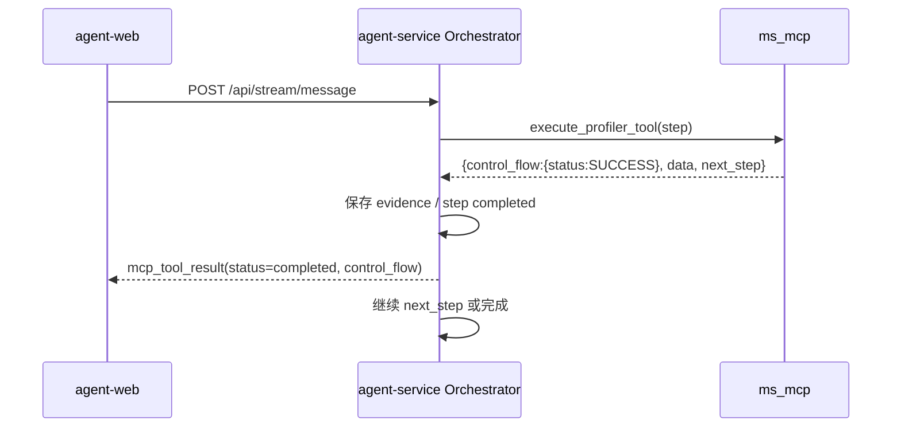
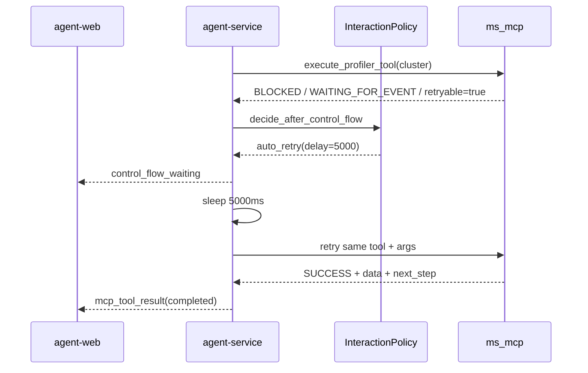
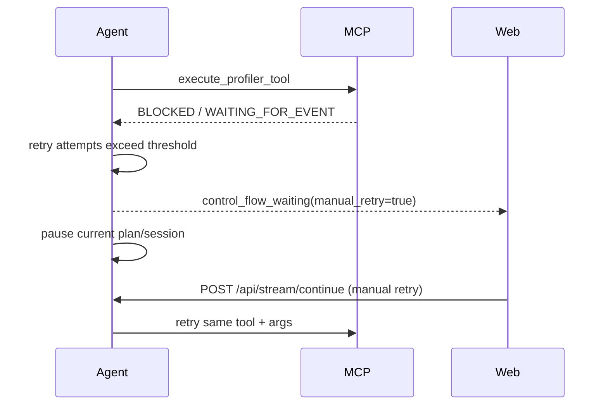
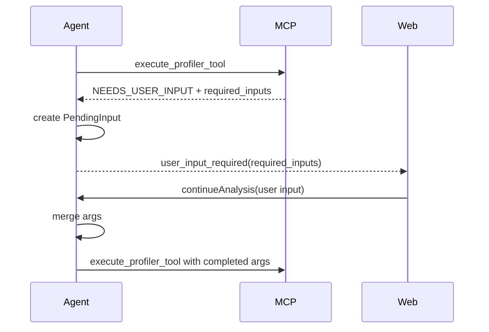
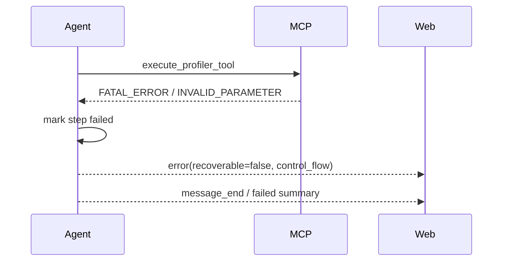

# MCP 结构化流程控制详细设计

## 1. 设计目标

本文档基于 `docs/mcp_structured_control_flow_requirements.md`，对 MCP 结构化流程控制能力进行详细设计，覆盖 `ms_mcp`、`agent-service` 与 `agent-web` 三端的接口、组件、状态流转、错误处理、自动重试、用户输入、前端渲染与测试方案。

本设计面向当前 demo 阶段，遵循以下前提：

- 不兼容旧 MCP 响应协议；
- 不再通过 Markdown / text 文本解析控制流；
- 所有 `execute_profiler_tool` 的结构化结果必须包含 `control_flow`；
- 缺失或非法 `control_flow` 统一视为 MCP 协议错误；
- MCP 只报告事实和建议，自动等待、自动重试、暂停、终止由 `agent-service` 决策；
- 前端根据结构化 `status` / `reason` 渲染 UI。

---

## 2. 当前系统关键现状

### 2.1 MCP 服务端现状

`mcp_service_code/ms_mcp` 当前是 Progressive Disclosure Meta-Tool Gateway：

- 对 AI 客户端仅暴露：
  - `search_profiler_tools`
  - `execute_profiler_tool`
- 内部 profiler 工具通过 decorator 注册；
- playbook 通过 YAML 与 navigator/state 驱动；
- `execute_profiler_tool` 执行内部工具后返回文本和结构化内容；
- 当前阻塞/错误语义仍可能混杂在 Markdown 文本中。

### 2.2 agent-service 现状

关键模块：

- `agent-service/src/adapters/mcp_gateway.py`
  - 统一调用 MCP meta-tools；
  - 当前 `execute_profiler_tool()` 会从 MCP 响应中提取 text / raw；
  - 当前 `next_step`、用户输入提示等仍部分依赖文本解析。

- `agent-service/src/adapters/mcp_response_parser.py`
  - 当前包含正则和文本 marker 解析；
  - `requires_user_input()` 通过中文关键词、符号等判断；
  - `parse_next_step()` 对执行结果主要依赖文本。

- `agent-service/src/core/orchestrator.py`
  - 动态 MCP playbook orchestration 主流程；
  - 先 `search_profiler_tools`，再执行 `initial_step`，随后根据 MCP 返回的 `next_step` 自动推进；
  - 对 MCP 工具异常会发送 SSE `error`，但尚未内建结构化 `BLOCKED` / `RETRYABLE_ERROR` 自动重试策略。

- `agent-service/src/core/interaction_policy.py`
  - 当前负责自动继续、用户输入、确认、最大自动步数等策略；
  - 后续应扩展为结构化控制流策略入口。

### 2.3 agent-web 现状

关键模块：

- `agent-web/src/services/api.ts`
  - 使用 `fetch + ReadableStream` 解析 SSE；
  - `SSEEventData` 类型较宽松。

- `agent-web/src/components/ChatView.tsx`
  - 统一处理 SSE 事件；
  - `user_input_required` 已有基础等待输入 UI；
  - `mcp_tool_result` 当前主要进入 trace timeline；
  - 暂无结构化 control flow 专用等待/重试/错误卡片。

- `agent-web/src/types/index.ts`
  - 已定义 SSE event、execution step、user input、error 等基础类型；
  - 尚未定义 `ControlFlow`、`ControlFlowStatus`、`ControlFlowReason` 等强类型。

---

## 3. 总体架构设计

### 3.1 分层职责

```text
┌─────────────────────────────────────────────────────────────┐
│ agent-web                                                   │
│ - 解析 SSE                                                  │
│ - 根据 status / reason 渲染等待、重试、输入、错误 UI          │
│ - 不解析 MCP Markdown 文本                                  │
└──────────────────────────────▲──────────────────────────────┘
                               │ SSE events
┌──────────────────────────────┴──────────────────────────────┐
│ agent-service                                                │
│ - MCPGateway 调用 MCP meta-tools                             │
│ - MCPResponseParser 校验/归一化 control_flow                 │
│ - Orchestrator 根据 control_flow 驱动 playbook               │
│ - InteractionPolicy 决策等待、重试、暂停、终止                │
│ - 发送结构化 SSE                                             │
└──────────────────────────────▲──────────────────────────────┘
                               │ MCP call_tool
┌──────────────────────────────┴──────────────────────────────┐
│ ms_mcp                                                       │
│ - execute_profiler_tool 统一包装内部工具结果                 │
│ - 所有执行结果返回 control_flow + data                       │
│ - 报告 status、reason、retryable、operation_id、next_step     │
│ - 不做复杂轮询/自动重试                                      │
└─────────────────────────────────────────────────────────────┘
```

### 3.2 核心设计原则

1. **控制流只读结构化字段**
   - `agent-service` 只读取 `result.raw.control_flow`；
   - `text` 只用于展示、日志或 LLM 辅助理解。

2. **MCP 统一出口包装**
   - `ms_mcp` 尽可能在 `execute_profiler_tool` 的统一出口包装 `control_flow`，避免每个工具重复实现。

3. **Agent 策略中心化**
   - 自动重试、等待时长、最大次数、防死锁阈值由 `agent-service` 统一配置和执行。

4. **前端模板化渲染**
   - 前端以 `reason` 映射组件和标准文案；
   - `user_message` 仅兜底。

---

## 4. 数据模型设计

### 4.1 MCP 执行结果顶层结构

`execute_profiler_tool` 的结构化返回体必须满足：

```json
{
  "control_flow": {
    "status": "SUCCESS"
  },
  "data": {},
  "next_step": null,
  "progress": {
    "current_step": 1,
    "total_steps": 3
  }
}
```

字段说明：

| 字段 | 类型 | 必填 | 说明 |
| --- | --- | --- | --- |
| `control_flow` | object | 是 | 控制流对象。 |
| `data` | object | 是 | 业务结果、错误详情或中间结果。 |
| `next_step` | object/null | 否 | MCP playbook navigator 给出的下一步。建议保留在顶层，便于 agent-service 读取。 |
| `progress` | object | 否 | playbook 进度信息。 |
| `metadata` | object | 否 | 调试、trace、内部辅助信息。 |

> 说明：需求文档只强制 `control_flow + data`。设计上建议 `next_step` 与 `progress` 继续作为结构化顶层字段返回，替代旧的 Markdown 文本解析。

### 4.2 ControlFlow 模型

建议在 `agent-service/src/models/orchestration.py` 或新文件 `agent-service/src/models/control_flow.py` 增加：

```python
class ControlFlowStatus(str, Enum):
    SUCCESS = "SUCCESS"
    BLOCKED = "BLOCKED"
    RETRYABLE_ERROR = "RETRYABLE_ERROR"
    FATAL_ERROR = "FATAL_ERROR"
    NEEDS_USER_INPUT = "NEEDS_USER_INPUT"


class ControlFlowReason(str, Enum):
    WAITING_FOR_EVENT = "WAITING_FOR_EVENT"
    RESOURCE_UNAVAILABLE = "RESOURCE_UNAVAILABLE"
    RATE_LIMITED = "RATE_LIMITED"
    MISSING_REQUIRED_PARAMETER = "MISSING_REQUIRED_PARAMETER"
    USER_CONFIRMATION_REQUIRED = "USER_CONFIRMATION_REQUIRED"
    INVALID_PARAMETER = "INVALID_PARAMETER"
    BACKEND_ERROR = "BACKEND_ERROR"
    TIMEOUT = "TIMEOUT"
    MCP_PROTOCOL_ERROR = "MCP_PROTOCOL_ERROR"


class RequiredInput(BaseModel):
    name: str
    type: str = "string"
    description: str | None = None
    required: bool = True
    options: list[dict[str, Any]] | None = None
    default: Any | None = None


class ControlFlow(BaseModel):
    status: ControlFlowStatus
    reason: ControlFlowReason | None = None
    retryable: bool | None = None
    suggested_retry_after_ms: int | None = None
    event_name: str | None = None
    operation_id: str | None = None
    required_inputs: list[RequiredInput] | None = None
    message_params: dict[str, Any] = Field(default_factory=dict)
    user_message: str | None = None
    developer_message: str | None = None
```

### 4.3 MCPToolResult 扩展

现有 `MCPToolResult` 建议增加：

```python
class MCPToolResult(BaseModel):
    tool_name: str
    success: bool
    text: str
    raw: dict[str, Any] = Field(default_factory=dict)
    next_step: MCPNextStep | None = None
    progress: dict[str, Any] = Field(default_factory=dict)
    requires_user_input: bool = False

    # 新增
    control_flow: ControlFlow
    data: dict[str, Any] = Field(default_factory=dict)
```

兼容当前内部使用时，`success` 不再简单等价于“没有 ERROR 文本”，而由 `control_flow.status` 派生：

| `status` | `success` 建议值 | 说明 |
| --- | --- | --- |
| `SUCCESS` | `true` | 正常成功。 |
| `BLOCKED` | `true` | 非失败，是预期等待。 |
| `NEEDS_USER_INPUT` | `true` | 非失败，是流程暂停。 |
| `RETRYABLE_ERROR` | `false` | 临时异常。 |
| `FATAL_ERROR` | `false` | 不可恢复异常。 |

---

## 5. ms_mcp 服务端设计

### 5.1 统一包装点

建议在 `execute_profiler_tool` 的实现路径中增加统一包装函数，而不是要求所有内部工具手动构造完整返回。

目标结构：

```text
execute_profiler_tool
  ├─ validate tool_name / arguments
  ├─ call internal profiler tool
  ├─ navigator computes next_step / progress
  ├─ normalize internal result
  └─ wrap_structured_control_flow_result
```

### 5.2 包装函数设计

```python
def wrap_success(data: dict[str, Any], *, next_step=None, progress=None) -> dict[str, Any]:
    return {
        "control_flow": {"status": "SUCCESS"},
        "data": data or {},
        "next_step": next_step,
        "progress": progress or {},
    }


def wrap_blocked(
    *,
    reason: str,
    event_name: str | None = None,
    operation_id: str | None = None,
    suggested_retry_after_ms: int | None = None,
    data: dict[str, Any] | None = None,
    message_params: dict[str, Any] | None = None,
    developer_message: str | None = None,
) -> dict[str, Any]:
    return {
        "control_flow": {
            "status": "BLOCKED",
            "reason": reason,
            "event_name": event_name,
            "operation_id": operation_id,
            "retryable": True,
            "suggested_retry_after_ms": suggested_retry_after_ms,
            "message_params": message_params or {},
            "developer_message": developer_message,
        },
        "data": data or {},
    }
```

同理提供：

- `wrap_retryable_error(...)`
- `wrap_fatal_error(...)`
- `wrap_needs_user_input(...)`

### 5.3 内部工具返回规范

内部工具可以返回较简化的结构，由统一出口归一化：

```python
{
    "status": "blocked",
    "reason": "WAITING_FOR_EVENT",
    "event_name": "clusterCompleted",
    "operation_id": "cluster-op-123",
    "retry_after_ms": 5000,
}
```

统一出口转换为标准契约：

```json
{
  "control_flow": {
    "status": "BLOCKED",
    "reason": "WAITING_FOR_EVENT",
    "event_name": "clusterCompleted",
    "operation_id": "cluster-op-123",
    "retryable": true,
    "suggested_retry_after_ms": 5000
  },
  "data": {}
}
```

### 5.4 异步任务与 operation_id

对于第一次调用可能触发异步任务的工具，MCP 端必须保证：

1. 相同 session/profile/step/arguments 不重复创建后台任务；
2. 首次创建任务后返回稳定的 `operation_id`；
3. 后续同参数重试检查同一个 `operation_id`；
4. 若任务完成，返回 `SUCCESS` 与结果数据；
5. 若任务仍未完成，返回 `BLOCKED`。

建议 `operation_id` 生成规则：

```text
{playbook_id}:{tool_name}:{session_id}:{profile_hash}:{operation_kind}
```

若没有显式 session id，可使用 MCP state/session 中已有上下文标识与 profile 路径 hash。

### 5.5 错误映射

| MCP 内部情况 | control_flow |
| --- | --- |
| 参数缺失但可由用户补充 | `NEEDS_USER_INPUT / MISSING_REQUIRED_PARAMETER` |
| 参数存在但非法 | `FATAL_ERROR / INVALID_PARAMETER` |
| 后端 WebSocket 短暂断开 | `RETRYABLE_ERROR / BACKEND_ERROR` |
| 后端限流 | `RETRYABLE_ERROR / RATE_LIMITED` |
| 后端超时但可重试 | `RETRYABLE_ERROR / TIMEOUT` |
| profile 文件不存在 | `FATAL_ERROR / INVALID_PARAMETER` |
| playbook 配置错误 | `FATAL_ERROR / BACKEND_ERROR` |
| 等待 cluster 完成 | `BLOCKED / WAITING_FOR_EVENT` |
| 等待资源生成 | `BLOCKED / RESOURCE_UNAVAILABLE` |

### 5.6 Markdown 输出要求

MCP 可继续返回 Markdown 文本用于展示，例如：

```markdown
聚类分析正在生成，请稍后查看。
```

但不得使用机器协议式文本：

```markdown
BLOCKED: waiting clusterCompleted
```

如果为了人类可读性提到“等待”，也不得让 agent-service 依赖该文本。

---

## 6. agent-service 设计

### 6.1 MCPGateway 改造

`MCPGateway.execute_profiler_tool()` 应按以下流程处理 MCP 响应：

```text
call_tool(execute_profiler_tool)
  ├─ extract text
  ├─ extract structured raw
  ├─ parse_and_validate_control_flow(raw)
  ├─ parse data from raw.data
  ├─ parse next_step from raw.next_step, not text
  ├─ derive success/requires_user_input
  └─ return MCPToolResult(control_flow=..., data=...)
```

关键变化：

- 不再使用 `text.startswith("ERROR")` 判断失败；
- 不再使用 `parser.requires_user_input(text)` 判断用户输入；
- `next_step` 优先且原则上只从结构化 `raw.next_step` 读取；
- 缺失 `control_flow` 时不 fallback，直接归一化为 `FATAL_ERROR / MCP_PROTOCOL_ERROR`。

### 6.2 MCPResponseParser 改造

新增结构化解析函数：

```python
def parse_control_flow(self, raw: dict[str, Any]) -> ControlFlow:
    ...


def normalize_protocol_error(self, error: str) -> ControlFlow:
    return ControlFlow(
        status=ControlFlowStatus.FATAL_ERROR,
        reason=ControlFlowReason.MCP_PROTOCOL_ERROR,
        retryable=False,
        developer_message=error,
    )
```

校验规则：

| 条件 | 校验 |
| --- | --- |
| 顶层缺失 `control_flow` | 协议错误 |
| `control_flow.status` 缺失 | 协议错误 |
| status 非枚举 | 协议错误 |
| `BLOCKED` 缺失 `reason` 或 `retryable` | 协议错误 |
| `BLOCKED / WAITING_FOR_EVENT` 缺失 `event_name` | 协议错误 |
| 异步 `BLOCKED` 缺失 `operation_id` | 协议错误或 developer warning；demo 建议协议错误 |
| `RETRYABLE_ERROR` 缺失 `retryable` | 协议错误 |
| `retryable=true` 但无 `suggested_retry_after_ms` | demo 可 warning，建议补默认值 |
| `NEEDS_USER_INPUT` 缺失 `required_inputs` | 协议错误 |
| `FATAL_ERROR` 缺失 `reason` | 协议错误 |

### 6.3 Orchestrator 控制流分派

`_execute_mcp_chain()` 中 MCP 调用返回后，应先处理 `control_flow`，再决定是否继续 next step。

伪代码：

```python
result = await self.mcp_gateway.execute_profiler_tool(current_tool, current_args)
cf = result.control_flow

match cf.status:
    case SUCCESS:
        emit mcp_tool_result(status="completed", control_flow=cf)
        continue_or_finish_by_next_step(result.next_step)

    case BLOCKED:
        decision = self.interaction_policy.decide_control_flow_retry(
            cf,
            tool_name=current_tool,
            arguments=current_args,
            retry_state=retry_state,
        )
        if decision.action == "auto_retry":
            emit control_flow_waiting
            await sleep(decision.delay_ms)
            retry same tool/arguments
        else:
            create pending input or emit waiting/manual retry event
            pause

    case RETRYABLE_ERROR:
        decision = self.interaction_policy.decide_control_flow_retry(...)
        if decision.action == "auto_retry":
            emit control_flow_retrying
            await sleep(decision.delay_ms)
            retry same tool/arguments
        else:
            emit error(recoverable=True)
            stop or pause

    case NEEDS_USER_INPUT:
        pending = pending_from_required_inputs(cf.required_inputs)
        emit user_input_required
        pause

    case FATAL_ERROR:
        emit error(recoverable=False, reason=cf.reason)
        fail current step/playbook
```

### 6.4 RetryState 设计

为了防止无限循环，需要在一次 MCP chain 内维护 retry 状态：

```python
class ControlFlowRetryState(BaseModel):
    key: str
    attempts: int = 0
    total_wait_ms: int = 0
    first_seen_at: datetime
    last_operation_id: str | None = None
```

`key` 建议：

```text
{session_id}:{plan_id}:{tool_name}:{operation_id or args_hash}:{status}:{reason}
```

对于 `BLOCKED / WAITING_FOR_EVENT`，优先使用 `operation_id`，保证同一异步任务的等待被累计。

### 6.5 InteractionPolicy 扩展

新增策略方法：

```python
class ControlFlowDecision(BaseModel):
    action: Literal[
        "continue_auto",
        "auto_retry",
        "pause_waiting",
        "require_user_input",
        "fail",
        "stop",
    ]
    delay_ms: int | None = None
    reason: str | None = None


def decide_after_control_flow(
    self,
    control_flow: ControlFlow,
    *,
    retry_state: ControlFlowRetryState,
    tool_name: str,
    arguments: dict[str, Any],
) -> ControlFlowDecision:
    ...
```

建议策略配置：

```yaml
control_flow:
  max_auto_retries: 3
  max_total_wait_ms: 30000
  default_retry_after_ms: 3000
  max_retry_after_ms: 10000
  pause_on_blocked_after_retries: true
```

策略规则：

| 状态 | 策略 |
| --- | --- |
| `SUCCESS` | 继续 next_step 或结束。 |
| `BLOCKED + retryable=true` | 阈值内自动等待重试；超限后暂停等待或提示用户手动重试。 |
| `BLOCKED + retryable=false` | 暂停等待或请求用户介入。 |
| `RETRYABLE_ERROR + retryable=true` | 阈值内自动重试；超限后发送 recoverable error。 |
| `RETRYABLE_ERROR + retryable=false` | 视为异常协议组合，可按 fatal 处理。 |
| `NEEDS_USER_INPUT` | 创建 pending input。 |
| `FATAL_ERROR` | 不重试，失败。 |

### 6.6 SSE 事件设计

保留现有事件，同时增加结构化字段。

#### 6.6.1 mcp_tool_result

```json
{
  "event": "mcp_tool_result",
  "data": {
    "tool_name": "cluster_analyze",
    "status": "blocked",
    "control_flow": {
      "status": "BLOCKED",
      "reason": "WAITING_FOR_EVENT",
      "event_name": "clusterCompleted",
      "operation_id": "cluster-op-123",
      "retryable": true,
      "suggested_retry_after_ms": 5000
    },
    "data": {},
    "next_step": null,
    "elapsed_ms": 120
  }
}
```

#### 6.6.2 control_flow_waiting

建议新增事件，专门表达 Agent 已决定等待：

```json
{
  "event": "control_flow_waiting",
  "data": {
    "tool_name": "cluster_analyze",
    "reason": "WAITING_FOR_EVENT",
    "event_name": "clusterCompleted",
    "operation_id": "cluster-op-123",
    "retry_after_ms": 5000,
    "attempt": 1,
    "max_attempts": 3,
    "message_params": {
      "seconds": 5
    }
  }
}
```

#### 6.6.3 control_flow_retrying

```json
{
  "event": "control_flow_retrying",
  "data": {
    "tool_name": "cluster_analyze",
    "reason": "TIMEOUT",
    "retry_after_ms": 3000,
    "attempt": 2,
    "max_attempts": 3
  }
}
```

#### 6.6.4 user_input_required

现有事件扩展 `control_flow` 与结构化 inputs：

```json
{
  "event": "user_input_required",
  "data": {
    "input_type": "params",
    "question": "请补充必要参数",
    "reason": "MISSING_REQUIRED_PARAMETER",
    "control_flow": {
      "status": "NEEDS_USER_INPUT",
      "reason": "MISSING_REQUIRED_PARAMETER"
    },
    "required_inputs": [
      {
        "name": "profile_path",
        "type": "string",
        "description": "请提供 profiling 数据路径"
      }
    ]
  }
}
```

#### 6.6.5 error

```json
{
  "event": "error",
  "data": {
    "code": "MCP_PROTOCOL_ERROR",
    "message": "MCP 返回体缺失 control_flow",
    "recoverable": false,
    "control_flow": {
      "status": "FATAL_ERROR",
      "reason": "MCP_PROTOCOL_ERROR",
      "retryable": false
    }
  }
}
```

### 6.7 PendingInput 映射

`NEEDS_USER_INPUT.required_inputs` 到现有 `PendingInput` 的转换：

| required input | PendingInput |
| --- | --- |
| 单个 string path 参数 | `input_type="path"` |
| 多个参数 | `input_type="params"` |
| options 非空 | `input_type="choice"` |
| reason = `USER_CONFIRMATION_REQUIRED` | `input_type="confirm"` |

Pending metadata 建议保存：

```json
{
  "resume_action": "continue_mcp",
  "tool_name": "xxx",
  "schema": {},
  "resolved_args": {},
  "required_inputs": [],
  "control_flow": {},
  "retry_state": {}
}
```

### 6.8 协议错误归一化

当 MCP 返回非法响应时，`MCPGateway` 不应直接抛出普通异常，而应返回可被 orchestrator 处理的 `MCPToolResult`：

```python
MCPToolResult(
    tool_name=tool_name,
    success=False,
    text=text,
    raw=raw,
    control_flow=ControlFlow(
        status=FATAL_ERROR,
        reason=MCP_PROTOCOL_ERROR,
        retryable=False,
        developer_message="missing control_flow",
    ),
    data={"error": "Invalid MCP structured control_flow response"},
)
```

这样可以保证：

- 统一走 control flow 分派；
- SSE error 中带上标准结构；
- 前端可以用统一 UI 展示。

---

## 7. agent-web 设计

### 7.1 TypeScript 类型

新增：

```ts
export type ControlFlowStatus =
  | 'SUCCESS'
  | 'BLOCKED'
  | 'RETRYABLE_ERROR'
  | 'FATAL_ERROR'
  | 'NEEDS_USER_INPUT'

export type ControlFlowReason =
  | 'WAITING_FOR_EVENT'
  | 'RESOURCE_UNAVAILABLE'
  | 'RATE_LIMITED'
  | 'MISSING_REQUIRED_PARAMETER'
  | 'USER_CONFIRMATION_REQUIRED'
  | 'INVALID_PARAMETER'
  | 'BACKEND_ERROR'
  | 'TIMEOUT'
  | 'MCP_PROTOCOL_ERROR'

export interface RequiredInput {
  name: string
  type: string
  description?: string
  required?: boolean
  options?: Array<{ label: string; value: string; description?: string }>
  default?: unknown
}

export interface ControlFlow {
  status: ControlFlowStatus
  reason?: ControlFlowReason
  retryable?: boolean
  suggested_retry_after_ms?: number
  event_name?: string
  operation_id?: string
  required_inputs?: RequiredInput[]
  message_params?: Record<string, unknown>
  user_message?: string
  developer_message?: string
}
```

### 7.2 SSE 类型扩展

新增事件类型：

```ts
export type SSEEventType =
  | ...
  | 'control_flow_waiting'
  | 'control_flow_retrying'
```

### 7.3 UI 组件设计

建议新增组件：

```text
agent-web/src/components/control-flow/
  ├─ ControlFlowCard.tsx
  ├─ WaitingStatusCard.tsx
  ├─ RetryStatusCard.tsx
  ├─ RequiredInputsForm.tsx
  └─ FatalErrorCard.tsx
```

#### 7.3.1 ControlFlowCard

统一入口：

```tsx
function ControlFlowCard({ controlFlow, data }: Props) {
  switch (controlFlow.status) {
    case 'BLOCKED':
      return <WaitingStatusCard controlFlow={controlFlow} />
    case 'RETRYABLE_ERROR':
      return <RetryStatusCard controlFlow={controlFlow} />
    case 'NEEDS_USER_INPUT':
      return <RequiredInputsForm controlFlow={controlFlow} />
    case 'FATAL_ERROR':
      return <FatalErrorCard controlFlow={controlFlow} data={data} />
    default:
      return null
  }
}
```

#### 7.3.2 reason 到文案映射

```ts
const controlFlowMessages: Record<ControlFlowReason, string> = {
  WAITING_FOR_EVENT: '正在等待后台事件完成',
  RESOURCE_UNAVAILABLE: '依赖资源正在准备中',
  RATE_LIMITED: '请求被限流，将稍后重试',
  MISSING_REQUIRED_PARAMETER: '需要补充必要参数',
  USER_CONFIRMATION_REQUIRED: '需要确认后继续',
  INVALID_PARAMETER: '参数无效，请检查后重试',
  BACKEND_ERROR: '后端服务异常',
  TIMEOUT: '请求超时',
  MCP_PROTOCOL_ERROR: 'MCP 协议响应异常',
}
```

### 7.4 ChatView 事件处理

`handleSSEEvent` 新增：

```ts
case 'control_flow_waiting':
case 'control_flow_retrying':
  addTraceEvent(normalizeTraceEvent(event))
  setControlFlowStatus(event.data)
  break

case 'mcp_tool_result':
  addTraceEvent(normalizeTraceEvent(event))
  if (event.data.control_flow?.status !== 'SUCCESS') {
    addControlFlowEvent(event.data)
  }
  break
```

### 7.5 输入表单

对于 `required_inputs`：

- 单参数 string：使用普通输入框；
- path：可复用当前 free-text 输入，也可独立表单；
- options：按钮组或 Select；
- confirm：确认/取消按钮；
- 多参数：JSON textarea 或动态表单。

Demo 阶段建议：

1. `options` 使用按钮组；
2. 单参数使用输入框；
3. 多参数使用 JSON textarea，降低实现复杂度。

### 7.6 SSE parser 注意事项

当前 SSE parser 在 chunk 边界处可能丢失已解析但未结束的 event 字段。设计上建议顺手修复：

- 将 `currentEvent`、`dataLines`、`currentId` 状态提升到 chunk 循环外；
- 只将未完整 line 保存在 `remaining`；
- 完整 event 直到遇到空行再 yield。

这不是结构化控制流的核心需求，但会影响新增事件稳定性。

---

## 8. 端到端时序设计

### 8.1 SUCCESS 路径



### 8.2 BLOCKED 自动等待路径



### 8.3 BLOCKED 超限暂停路径



### 8.4 NEEDS_USER_INPUT 路径



### 8.5 FATAL_ERROR 路径



---

## 9. 配置设计

### 9.1 agent-service config.yaml

新增：

```yaml
control_flow:
  enabled: true
  strict_protocol: true
  max_auto_retries: 3
  max_total_wait_ms: 30000
  default_retry_after_ms: 3000
  max_retry_after_ms: 10000
  emit_waiting_events: true
  pause_on_blocked_after_retries: true
```

字段说明：

| 字段 | 默认值 | 说明 |
| --- | --- | --- |
| `enabled` | `true` | 是否启用结构化控制流。demo 阶段应固定为 true。 |
| `strict_protocol` | `true` | 缺失 control_flow 是否直接协议错误。demo 阶段应固定为 true。 |
| `max_auto_retries` | `3` | 单个 retry key 最大自动重试次数。 |
| `max_total_wait_ms` | `30000` | 单个 retry key 最大累计等待时间。 |
| `default_retry_after_ms` | `3000` | MCP 未提供建议时的默认等待。 |
| `max_retry_after_ms` | `10000` | 单次等待上限，防止 MCP 返回过大值。 |
| `emit_waiting_events` | `true` | 是否发送 `control_flow_waiting` / `control_flow_retrying`。 |
| `pause_on_blocked_after_retries` | `true` | BLOCKED 超限后暂停而非直接失败。 |

### 9.2 ms_mcp 配置

可选新增环境变量：

```bash
MSINSIGHT_CONTROL_FLOW_STRICT=true
MSINSIGHT_DEFAULT_RETRY_AFTER_MS=5000
```

---

## 10. 持久化设计

### 10.1 Evidence

MCP observation evidence 应保存：

```json
{
  "tool_name": "cluster_analyze",
  "arguments": {},
  "control_flow": {},
  "data": {},
  "next_step": {},
  "operation_id": "cluster-op-123",
  "retry_attempt": 1
}
```

### 10.2 ExecutionStep

`execution_steps.output` 中保存完整结构化结果：

```json
{
  "control_flow": {},
  "data": {},
  "next_step": {},
  "progress": {}
}
```

`execution_steps.status` 映射建议：

| control_flow.status | execution step status |
| --- | --- |
| `SUCCESS` | `COMPLETED` |
| `BLOCKED` 自动等待中 | `RUNNING` 或 `WAITING`（若无 WAITING，可用 metadata 标记） |
| `BLOCKED` 超限暂停 | `WAITING_USER` |
| `NEEDS_USER_INPUT` | `WAITING_USER` |
| `RETRYABLE_ERROR` 自动重试中 | `RUNNING` |
| `RETRYABLE_ERROR` 超限 | `FAILED` |
| `FATAL_ERROR` | `FAILED` |

### 10.3 PendingInput

对 `BLOCKED` 超限暂停，可创建 pending input：

```json
{
  "input_type": "confirm",
  "question": "后台任务仍未完成，是否稍后重试？",
  "metadata": {
    "resume_action": "retry_mcp_tool",
    "tool_name": "cluster_analyze",
    "arguments": {},
    "control_flow": {},
    "retry_state": {}
  }
}
```

---

## 11. 实施计划

### Phase 1：MCP 契约与服务端包装

1. 定义 control flow 常量/模型；
2. 在 `execute_profiler_tool` 统一出口包装：
   - success；
   - blocked；
   - retryable error；
   - fatal error；
   - needs user input；
3. 将等待事件场景改为 `BLOCKED / WAITING_FOR_EVENT`；
4. 将参数缺失场景改为 `NEEDS_USER_INPUT`；
5. 确保 `next_step` 使用结构化字段返回；
6. 添加 MCP 服务端单元测试。

### Phase 2：agent-service 解析与控制流分派

1. 新增 `ControlFlow` 模型；
2. 改造 `MCPResponseParser`：
   - `parse_control_flow(raw)`；
   - `validate_control_flow(cf)`；
   - `parse_next_step` 从结构化 raw 读取；
3. 改造 `MCPGateway.execute_profiler_tool()`；
4. 扩展 `InteractionPolicy`；
5. 改造 `_execute_mcp_chain()`；
6. 增加 `control_flow_waiting` / `control_flow_retrying` SSE；
7. 添加后端测试。

### Phase 3：前端渲染

1. 新增 TS 类型；
2. 扩展 SSE event type；
3. 新增 ControlFlow UI 组件；
4. 改造 `ChatView.handleSSEEvent()`；
5. 支持等待倒计时、重试提示、required inputs 表单；
6. 修复 SSE parser chunk 边界状态问题；
7. 添加前端单元/组件测试。

### Phase 4：端到端验证

1. 构造 `SUCCESS` playbook；
2. 构造 `BLOCKED -> SUCCESS` playbook；
3. 构造 `BLOCKED` 超限暂停；
4. 构造 `NEEDS_USER_INPUT -> continue`；
5. 构造 `RETRYABLE_ERROR -> SUCCESS`；
6. 构造 `FATAL_ERROR`；
7. 构造非法 MCP response 验证 `MCP_PROTOCOL_ERROR`。

---

## 12. 测试设计

### 12.1 ms_mcp 测试

| 测试 | 期望 |
| --- | --- |
| 成功工具返回 | 包含 `control_flow.status=SUCCESS` 和 `data` |
| 等待事件 | 返回 `BLOCKED / WAITING_FOR_EVENT / event_name / operation_id` |
| 参数缺失 | 返回 `NEEDS_USER_INPUT / required_inputs` |
| 临时后端错误 | 返回 `RETRYABLE_ERROR / retryable=true` |
| 致命参数错误 | 返回 `FATAL_ERROR / INVALID_PARAMETER / retryable=false` |
| Markdown 中无机器协议 | 不包含用于解析的 `BLOCKED:` |

### 12.2 agent-service 单元测试

| 测试 | 期望 |
| --- | --- |
| 缺失 `control_flow` | 归一化为 `FATAL_ERROR / MCP_PROTOCOL_ERROR` |
| 非法 status | 协议错误 |
| `BLOCKED + retryable=true` | 阈值内自动重试 |
| `BLOCKED` 超过阈值 | 不无限循环，暂停或提示用户 |
| `RETRYABLE_ERROR` | 按策略重试 |
| `FATAL_ERROR` | 不重试，发送 error |
| `NEEDS_USER_INPUT` | 创建 pending input，发送 `user_input_required` |
| `next_step` 结构化字段 | 正确继续下一步，不依赖 text |

### 12.3 agent-web 测试

| 测试 | 期望 |
| --- | --- |
| `control_flow_waiting` | 展示等待卡片与倒计时 |
| `control_flow_retrying` | 展示重试提示 |
| `NEEDS_USER_INPUT` | 展示输入表单 |
| `FATAL_ERROR / MCP_PROTOCOL_ERROR` | 展示系统错误 |
| `mcp_tool_result` 非 SUCCESS | timeline 与 control flow UI 都更新 |
| SSE chunk 边界 | 不丢 event/data 状态 |

### 12.4 E2E 测试

建议使用 mock MCP 或测试 playbook：

1. 用户输入诊断请求；
2. MCP search 返回 initial step；
3. execute 第一次返回 BLOCKED；
4. Agent 自动等待并重试；
5. execute 第二次返回 SUCCESS + next_step；
6. 前端展示等待与完成状态；
7. 最终生成分析结果。

---

## 13. 风险与取舍

### 13.1 严格协议导致现有工具快速暴露问题

由于不兼容旧协议，任何未包装 `control_flow` 的 MCP 工具都会触发 `MCP_PROTOCOL_ERROR`。

取舍：

- demo 阶段可接受；
- 有利于尽早发现未改造路径；
- 实施时需要先覆盖主 demo playbook。

### 13.2 自动重试可能阻塞 SSE 流

如果 orchestrator 在同一个 SSE 请求中 `await sleep()`，用户连接会保持打开。

建议：

- demo 阶段可直接在流中等待，并发送 `control_flow_waiting`；
- 等待时间应有上限；
- 产品化阶段可考虑后台任务 + session resume。

### 13.3 operation_id 生成不稳定会导致重复任务

如果 MCP 不能稳定返回同一个 `operation_id`，Agent 的 retry state 难以正确累计。

建议：

- 对会启动后台任务的工具优先设计 operation registry；
- 对纯查询类工具可使用 args hash 作为 fallback。

### 13.4 前端表单复杂度

`required_inputs` 如果完全按 JSON schema 动态渲染会比较重。

建议 demo 阶段只支持：

- text/path；
- choice；
- confirm；
- 多字段 JSON textarea。

---

## 14. 与需求验收标准的对应关系

| 需求验收项 | 设计落点 |
| --- | --- |
| 所有成功响应包含 `SUCCESS` | MCP 统一包装 `wrap_success` |
| 阻塞响应包含 `BLOCKED` / `reason` / `retryable` | `wrap_blocked` + parser 校验 |
| `WAITING_FOR_EVENT` 包含 `event_name` | parser 条件校验 |
| 异步操作包含 `operation_id` | operation registry / 生成规则 |
| `NEEDS_USER_INPUT` 包含 `required_inputs` | `wrap_needs_user_input` + PendingInput 映射 |
| 不解析 Markdown `BLOCKED:` | Gateway/Parser 移除 text marker 控制流逻辑 |
| 缺失 `control_flow` 识别协议错误 | `parse_control_flow` 归一化 |
| 自动重试有阈值 | `ControlFlowRetryState` + InteractionPolicy |
| `FATAL_ERROR` 不重试 | control flow 分派 |
| 前端 reason 渲染 | ControlFlowCard + reason message map |

---

## 15. 推荐最小可落地范围

为了快速完成 demo，建议最小闭环为：

1. `ms_mcp.execute_profiler_tool` 对所有返回统一包装 `control_flow`；
2. 主 demo playbook 中至少覆盖：
   - `SUCCESS`；
   - `BLOCKED / WAITING_FOR_EVENT`；
   - `NEEDS_USER_INPUT`；
   - `FATAL_ERROR`；
3. `agent-service.MCPGateway` 严格解析 `raw.control_flow`；
4. `_execute_mcp_chain()` 支持：
   - `SUCCESS` 继续；
   - `BLOCKED` 自动重试 3 次；
   - `NEEDS_USER_INPUT` 暂停；
   - `FATAL_ERROR` 报错；
5. 前端先实现：
   - 等待卡片；
   - required input 基础表单；
   - fatal error 卡片；
6. 补齐后端单元测试与一个 E2E mock 流程。

该范围即可验证结构化控制流的核心价值，同时避免一次性引入复杂 tracing、完整动态表单、后台任务调度系统等产品化能力。
